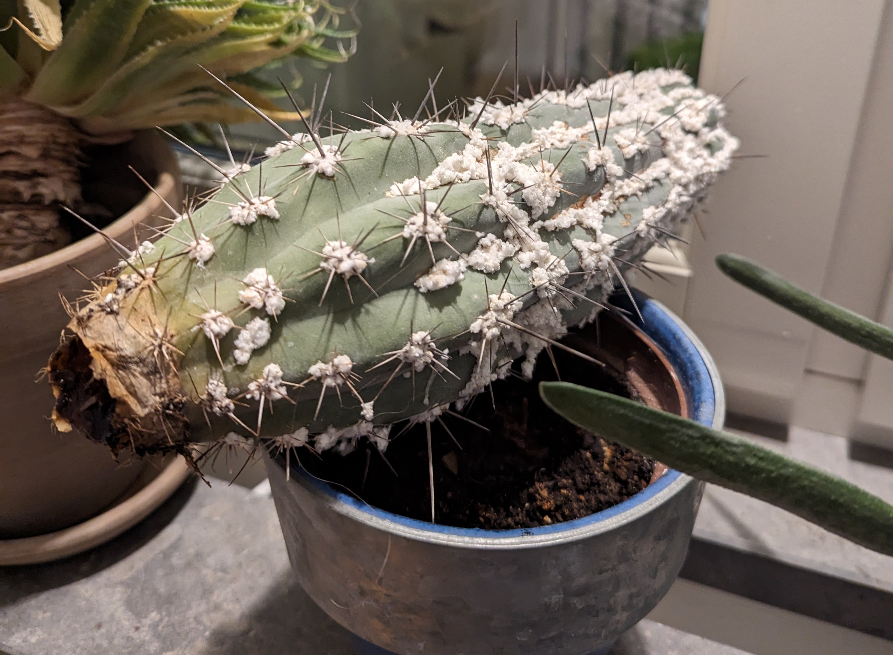

# Rotten Cactus Core

Due to overwatering a cactus can rot from the roots, up through the core of the stem.

Cut away the rotten parts carefully.
Wash knife to sterilize between cuts to not spread the rot to the healthy part.
When a cut looks fresh, you have cut away enough.

Let the healthy part lay on its side and dry for a few days, this will form a callous.

When callous is dry, repot in fresh easy to drain soil. TBC.