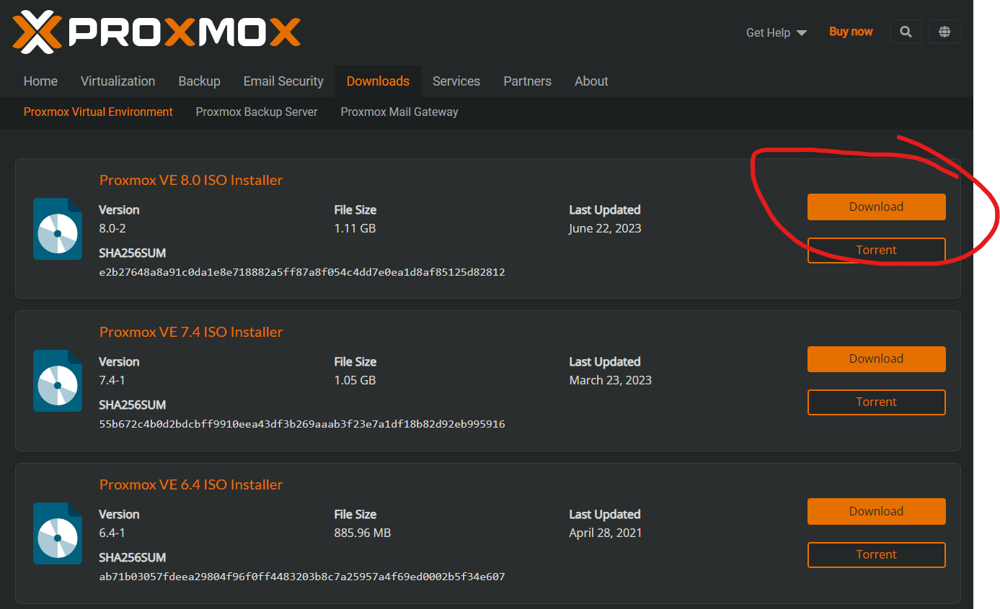

# proxmox setup

Download latest Proxmox ISO (8.0):\
https://www.proxmox.com/en/downloads/proxmox-virtual-environment/iso

Flash from file to USB using Balena Etcher:\
https://github.com/balena-io/etcher

Install on hardware.
I currently use:\
ASUS PN53 / Ryzen 7 7735H / 64 GB RAM / 1TB m2

Run this useful script to remove annoying popups about license.:\
https://github.com/foundObjects/pve-nag-buster/
